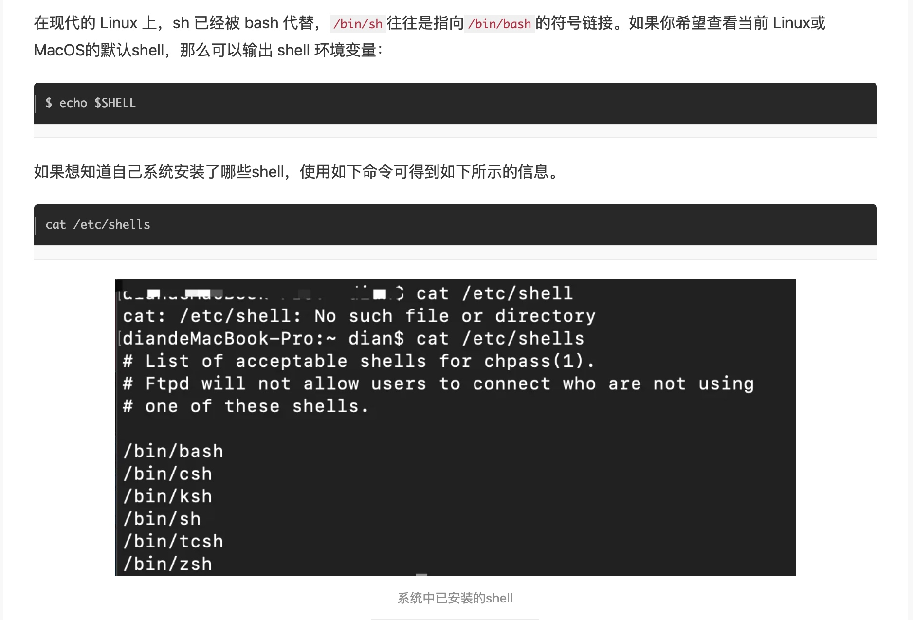
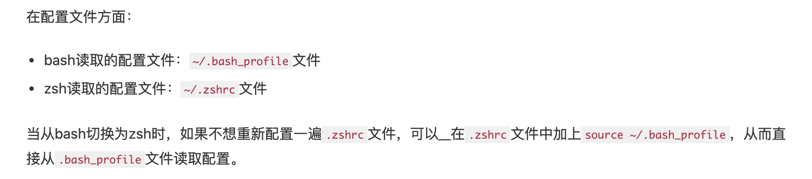

# 基础知识
## 
## 有哪些shell？
- zsh 很多人的 mac 中会使用 zsh 而不是 bash，一大半是因为 oh-my-zsh 这个配置集，它兼容  bash，还有自动补全等好用的功能。

- sh的全称是 Bourne shell，由 AT&T 公司的 Steve Bourne开发，为了纪念他，就用他的名字命名了。sh 是 UNIX 上的标准 shell，很多 UNIX 版本都配有 sh。sh 是第一个流行的 shell。

- csh sh 之后另一个广为流传的 shell 是由柏克莱大学的 Bill Joy 设计的，这个 shell 的语法有点类似C语言，所以才得名为 C shell ，简称为 csh。

- tcsh tcsh 是 csh 的增强版，加入了命令补全功能，提供了更加强大的语法支持。

- ash一个简单的轻量级的 Shell，占用资源少，适合运行于低内存环境，但是与下面讲到的 bash shell 完全兼容。

- bash bash由 GNU 组织开发，保持了对 sh shell 的兼容性，是各种 Linux 发行版默认配置的 shell。bash 兼容 sh 意味着，针对 sh 编写的 shell 代码可以不加修改地在 bash 中运行。尽管如此，bash 和 sh 还是有一些不同之处：一方面，bash 扩展了一些命令和参数；另一方面，bash 并不完全和 sh 兼容，它们有些行为并不一致，但在大多数企业运维的情况下区别不大，特殊场景可以使用 bash 代替 sh。

## 怎么查看自己使用的是哪一个shell？

## bash和zsh的区别
一句话，二者均是shell的一种，zsh能基本完美兼容bash的命令，并且使用起来更加优雅。由于bash或zsh本质上都是解释器，他们所共同服务的是shell语言，因此在命令语法上基本相同，有部分兼容性差异。

