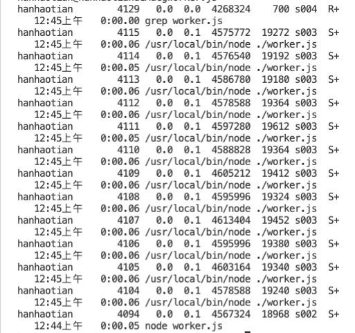

# ps aux | grep ...
ps命令（Process Status）进程查看命令
如果直接用ps命令，会显示所有进程的状态，通常结合grep命令查看某进程的状态。

grep （global search regular expression(RE) and print out the line,全面搜索正则表达式并把行打印出来）是一种强大的文本搜索工具，它能使用正则表达式搜索文本，并把匹配的行打印出来。

例如执行下面语句，查询到worker.js下运行的
```bash
grep aux | grep worker.js
```

