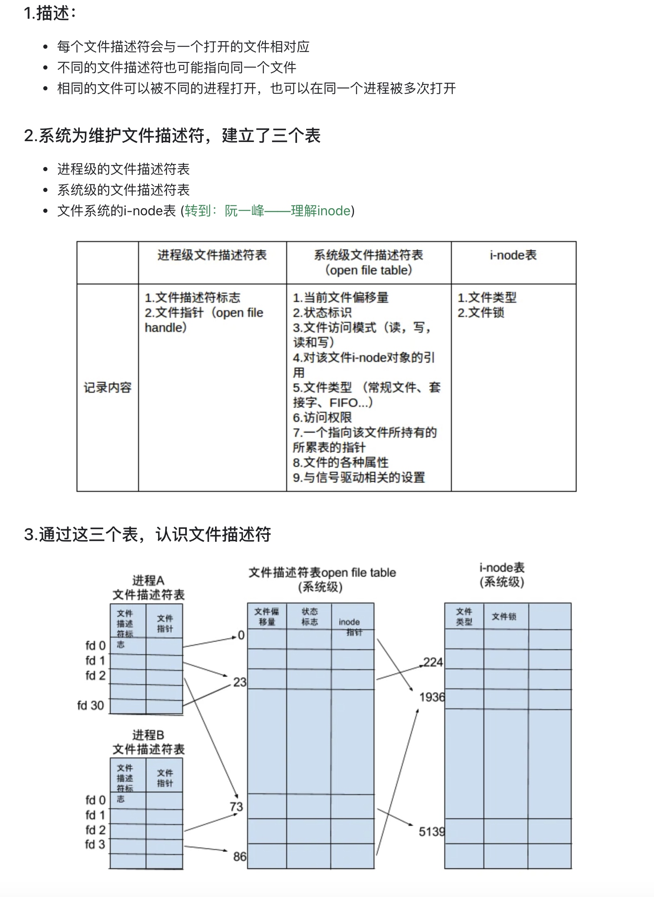

# 文件描述符
Linux 系统中，把一切都看做是文件，当进程打开现有文件或创建新文件时，内核向进程返回一个文件描述符，==文件描述符==就是内核为了高效管理已被打开的文件所创建的索引，用来==指向被打开的文件==，所有执行I/O操作的系统调用都会通过文件描述符。

在进程A中，文件描述符1和30都指向了同一个打开的文件句柄（#23），这可能是该进程多次对执行打开操作

进程A中的文件描述符2和进程B的文件描述符2都指向了同一个打开的文件句柄（#73），这种情况有几种可能，1.进程A和进程B可能是父子进程关系;2.进程A和进程B打开了同一个文件，且文件描述符相同（低概率事件=_=）；3.A、B中某个进程通过UNIX域套接字将一个打开的文件描述符传递给另一个进程。

进程A的描述符0和进程B的描述符3分别指向不同的打开文件句柄，但这些句柄均指向i-node表的相同条目（#1936），换言之，指向同一个文件。发生这种情况是因为每个进程各自对同一个文件发起了打开请求。同一个进程两次打开同一个文件，也会发生类似情况。